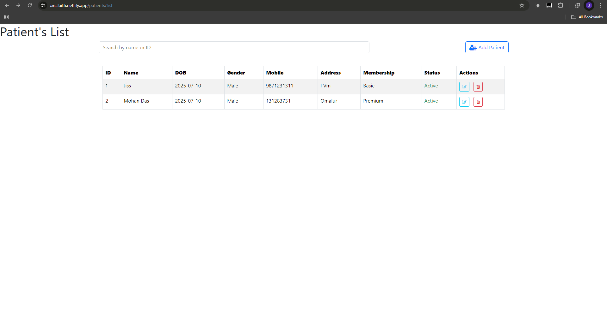
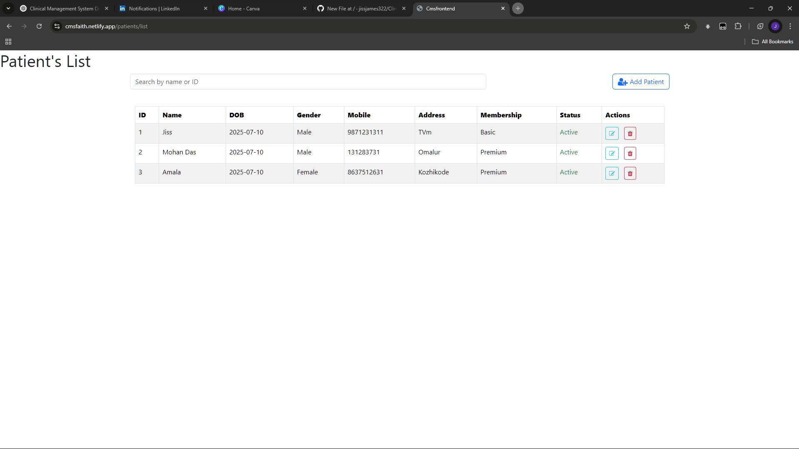
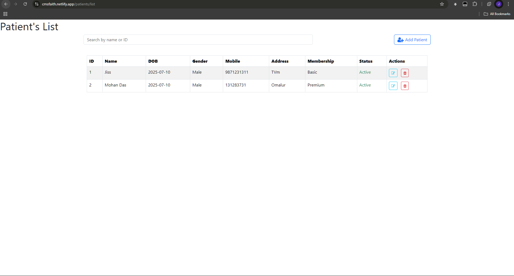

# Clinical Management System 🏥

A full-stack web application developed during an intensive 1-week training program at **Faith InfoTech**, Technopark, Thiruvananthapuram. The system was built by a 9-member team using **Angular**, **Django**, and a **PostgreSQL** backend (initially MySQL). The CMS streamlines hospital workflows like patient registration, staff and doctor management, appointments, prescriptions, and lab tests.

🔗 **Live Demo:** [cmsfaith.netlify.app](https://cmsfaith.netlify.app/)

---

## 💼 My Contribution

I was responsible for developing parts of the **Receptionist Module**, including:

- ✅ **Patient Management**:  
  - List all patients  
  - Add new patients  
  - Delete patient records  

- 🛠 **Membership Management**:  
  - Contributed to foundational setup and UI integration  

This fast-paced project helped sharpen my skills in full-stack development, API integration, and collaborative software engineering under real-time constraints.

---

## 🛠 Tech Stack

| Frontend       | Backend      | Database       | Deployment       |
|----------------|--------------|----------------|------------------|
| Angular        | Django       | MySQL → PostgreSQL | Netlify (Frontend) / Render (Backend) |

---

## 📂 Features (Team-Wide)

- Role-based access for Admins, Doctors, Receptionists, and Patients
- Patient Registration & Management
- Staff and Doctor Management
- Appointment Scheduling
- Prescription & Lab Test Tracking

---

## 📸 Screenshots

### 📋 Patient List Page

### ➕ Add Patient Form

### 🗑️ Delete Confirmation

---

## 🤝 Team Collaboration

This was a team effort with each member contributing specific modules such as authentication, consultation,  lab, and prescription handling.

---

## 📌 Notes

- Backend initially used MySQL and was migrated to PostgreSQL for better deployment compatibility.
- RESTful APIs were used for communication between frontend and backend.
- Emphasis on modular codebase and clean UI using SCSS and Angular components.

---

## 📫 Contact

Feel free to connect with me on [LinkedIn](https://www.linkedin.com/in/jissjames/) or reach out if you’d like to know more about my role in this project.
